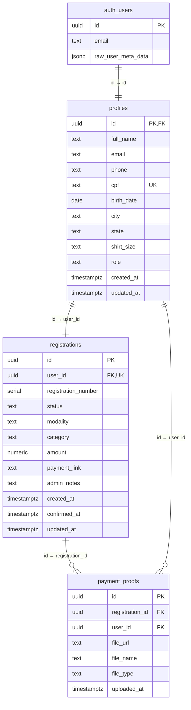

# 🗄️ Night Run Tapejara — Database Documentation

## Supabase Project

| Item | Valor |
|---|---|
| **Project ID** | `agkvkcpaaaimwhhopfpl` |
| **Project URL** | `https://agkvkcpaaaimwhhopfpl.supabase.co` |
| **Region** | `sa-east-1` (São Paulo) |
| **Postgres** | v17.6 |

---

## Estrutura de Arquivos

```
supabase/
├── migrations/
│   ├── 000_full_migration.sql    ← Todas as migrações em 1 arquivo (para recriar do zero)
│   ├── 001_create_profiles_table.sql
│   ├── 002_create_registrations_table.sql
│   ├── 003_create_payment_proofs_table.sql
│   ├── 004_create_rls_policies.sql
│   └── 005_create_storage_bucket_and_policies.sql
├── seed.sql                       ← Dados iniciais / instruções de setup
└── DATABASE.md                    ← Este arquivo
```

### Como migrar para outro banco

1. Crie um novo projeto Supabase
2. Abra o **SQL Editor** do novo projeto
3. Execute o arquivo `000_full_migration.sql` completo
4. Atualize o `SUPABASE_URL` e `SUPABASE_ANON_KEY` em `js/supabase-config.js`

> Para migrações incrementais, execute os arquivos `001` a `005` na ordem.

---

## Diagrama ER



---

## Tabelas

### `profiles`

Estende `auth.users` com dados do atleta.

| Coluna | Tipo | Nullable | Default | Descrição |
|---|---|---|---|---|
| `id` | UUID (PK, FK) | NOT NULL | — | Referência a `auth.users(id)` |
| `full_name` | TEXT | NOT NULL | — | Nome completo |
| `email` | TEXT | NOT NULL | — | Email |
| `phone` | TEXT | NULL | — | Telefone |
| `cpf` | TEXT (UNIQUE) | NULL | — | CPF (11 dígitos, sem pontuação) |
| `birth_date` | DATE | NULL | — | Data de nascimento |
| `city` | TEXT | NULL | — | Cidade |
| `state` | TEXT | NULL | `'PR'` | Estado (UF) |
| `shirt_size` | TEXT | NULL | — | Tamanho camiseta: `PP, P, M, G, GG, EG` |
| `role` | TEXT | NOT NULL | `'athlete'` | Nível de acesso: `athlete` ou `admin` |
| `created_at` | TIMESTAMPTZ | NOT NULL | `now()` | Data de criação |
| `updated_at` | TIMESTAMPTZ | NOT NULL | `now()` | Última atualização |

**Índices:** `idx_profiles_role`, `idx_profiles_city`, `idx_profiles_cpf`

---

### `registrations`

Inscrições dos atletas no evento.

| Coluna | Tipo | Nullable | Default | Descrição |
|---|---|---|---|---|
| `id` | UUID (PK) | NOT NULL | `gen_random_uuid()` | ID da inscrição |
| `user_id` | UUID (FK, UNIQUE) | NOT NULL | — | Referência a `profiles(id)` |
| `registration_number` | SERIAL | NOT NULL | Auto-increment | Nº de inscrição sequencial |
| `status` | TEXT | NOT NULL | `'pending_payment'` | Status (ver tabela abaixo) |
| `modality` | TEXT | NOT NULL | `'5km'` | Modalidade da corrida |
| `category` | TEXT | NULL | — | Categoria (idade, geral, etc.) |
| `amount` | NUMERIC(10,2) | NOT NULL | `60.00` | Valor da inscrição em R$ |
| `payment_link` | TEXT | NULL | — | Link para portal de pagamento |
| `admin_notes` | TEXT | NULL | — | Observações do administrador |
| `created_at` | TIMESTAMPTZ | NOT NULL | `now()` | Data da inscrição |
| `confirmed_at` | TIMESTAMPTZ | NULL | — | Data de confirmação do pagamento |
| `updated_at` | TIMESTAMPTZ | NOT NULL | `now()` | Última atualização |

**Status possíveis:**

| Status | Descrição | Cor |
|---|---|---|
| `pending_payment` | Pagamento pendente | 🟡 Amarelo |
| `awaiting_approval` | Comprovante enviado, aguardando aprovação | 🔵 Azul |
| `confirmed` | Pagamento aprovado, inscrição confirmada | 🟢 Verde |
| `rejected` | Pagamento rejeitado pelo admin | 🔴 Vermelho |
| `cancelled` | Inscrição cancelada | ⚫ Cinza |

**Índices:** `idx_registrations_user`, `idx_registrations_status`

---

### `payment_proofs`

Comprovantes de pagamento enviados pelos atletas.

| Coluna | Tipo | Nullable | Default | Descrição |
|---|---|---|---|---|
| `id` | UUID (PK) | NOT NULL | `gen_random_uuid()` | ID do comprovante |
| `registration_id` | UUID (FK) | NOT NULL | — | Referência a `registrations(id)` |
| `user_id` | UUID (FK) | NOT NULL | — | Referência a `profiles(id)` |
| `file_url` | TEXT | NOT NULL | — | URL do arquivo no Supabase Storage |
| `file_name` | TEXT | NULL | — | Nome original do arquivo |
| `file_type` | TEXT | NULL | — | MIME type (`image/jpeg`, `application/pdf`) |
| `uploaded_at` | TIMESTAMPTZ | NOT NULL | `now()` | Data do upload |

**Índices:** `idx_payment_proofs_registration`, `idx_payment_proofs_user`

---

## Triggers

| Trigger | Tabela | Evento | Função | Descrição |
|---|---|---|---|---|
| `on_auth_user_created` | `auth.users` | AFTER INSERT | `handle_new_user()` | Cria perfil automaticamente |
| `on_profile_created` | `profiles` | AFTER INSERT | `handle_new_registration()` | Cria inscrição para atletas |
| `on_profiles_updated` | `profiles` | BEFORE UPDATE | `handle_updated_at()` | Atualiza `updated_at` |
| `on_registrations_updated` | `registrations` | BEFORE UPDATE | `handle_updated_at()` | Atualiza `updated_at` |

---

## RLS Policies

### profiles

| Policy | Operação | Regra |
|---|---|---|
| Users can read own profile | SELECT | `auth.uid() = id` |
| Users can update own profile | UPDATE | `auth.uid() = id AND role = 'athlete'` |
| Admins can read all profiles | SELECT | Admin check |
| Admins can update all profiles | UPDATE | Admin check |

### registrations

| Policy | Operação | Regra |
|---|---|---|
| Users can read own registration | SELECT | `auth.uid() = user_id` |
| Admins can read all registrations | SELECT | Admin check |
| Admins can update registrations | UPDATE | Admin check |

### payment_proofs

| Policy | Operação | Regra |
|---|---|---|
| Users can read own payment proofs | SELECT | `auth.uid() = user_id` |
| Users can insert own payment proofs | INSERT | `auth.uid() = user_id` |
| Admins can read all payment proofs | SELECT | Admin check |

---

## Storage

### Bucket: `payment-proofs`

| Config | Valor |
|---|---|
| Público | ❌ Não |
| Limite de tamanho | 5MB (5242880 bytes) |
| Formatos permitidos | `image/jpeg`, `image/png`, `image/webp`, `application/pdf` |

**Estrutura de pastas:** `{user_id}/{timestamp}.{ext}`

**Policies:**
- Atleta faz upload na pasta `{user_id}/`
- Atleta lê arquivos da pasta `{user_id}/`
- Admin lê todos os arquivos

---

## Queries Úteis

```sql
-- Promover usuário a admin
UPDATE public.profiles SET role = 'admin' WHERE email = 'admin@email.com';

-- Listar todos os inscritos com dados
SELECT r.registration_number, p.full_name, p.cpf, p.city, p.phone,
       p.shirt_size, r.status, r.amount, r.created_at
FROM registrations r
JOIN profiles p ON r.user_id = p.id
ORDER BY r.registration_number;

-- Contar por status
SELECT status, COUNT(*) as total FROM registrations GROUP BY status;

-- Total arrecadado (confirmados)
SELECT SUM(amount) as total_arrecadado FROM registrations WHERE status = 'confirmed';

-- Inscritos por cidade (top 10)
SELECT p.city, COUNT(*) as total
FROM profiles p
JOIN registrations r ON p.id = r.user_id
GROUP BY p.city ORDER BY total DESC LIMIT 10;

-- Atletas que enviaram comprovante mas não foram aprovados
SELECT p.full_name, p.email, r.status
FROM registrations r
JOIN profiles p ON r.user_id = p.id
WHERE r.status = 'awaiting_approval';

-- Distribuição de tamanhos de camiseta
SELECT shirt_size, COUNT(*) as total
FROM profiles WHERE role = 'athlete'
GROUP BY shirt_size ORDER BY total DESC;
```
